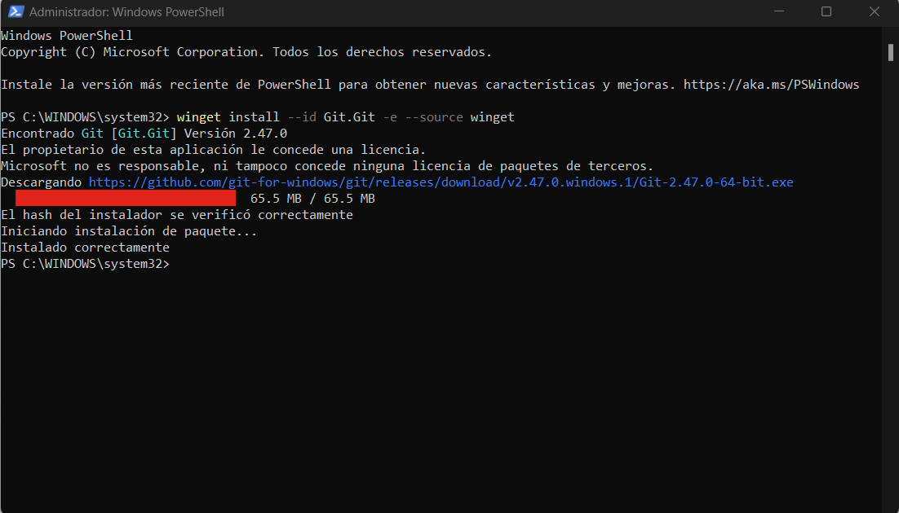
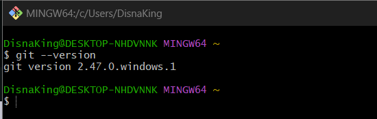
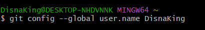
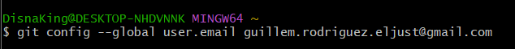
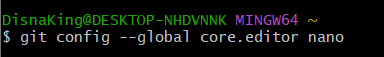
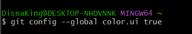
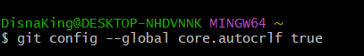
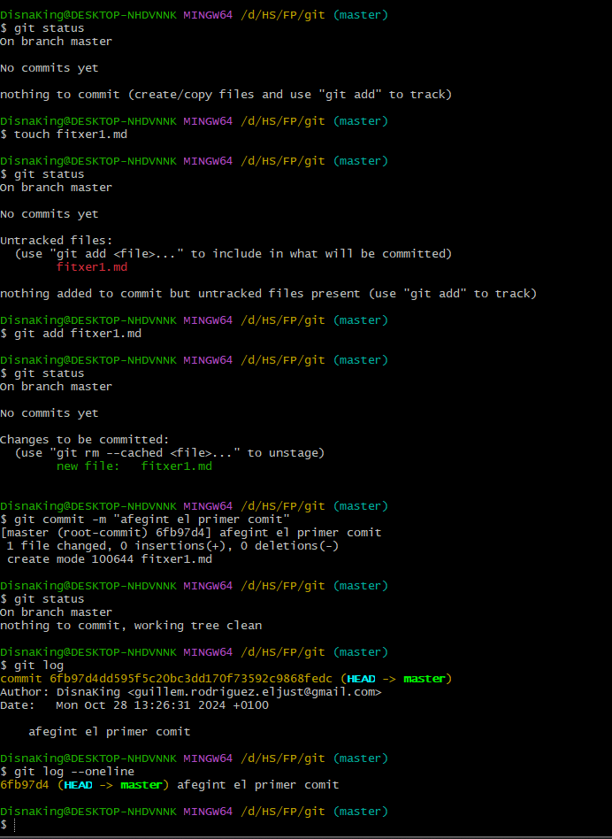
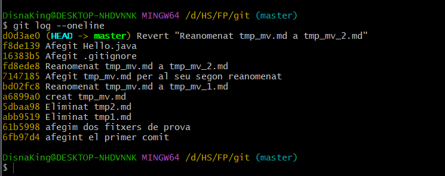

# Instalació GIT

## Descargar e instalar

## Versión

## Identitat de l'usuari

## Correu electrònic

## Editor de text

## Colors significatius

## Conversións al final de linea

## Configuració final

## Creació d'un fitxer

### Exercici

