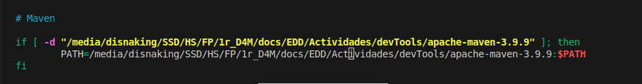
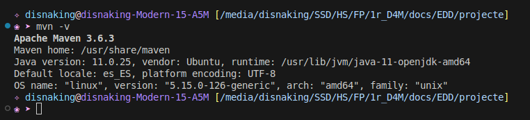
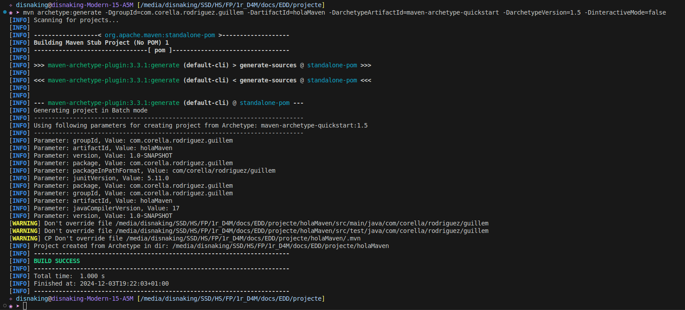
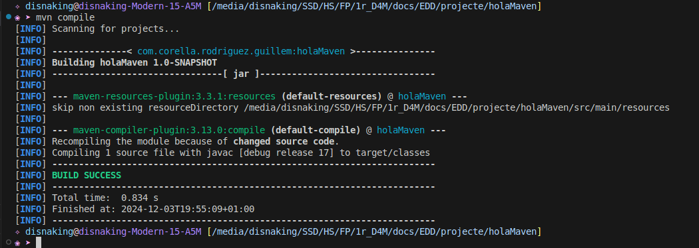
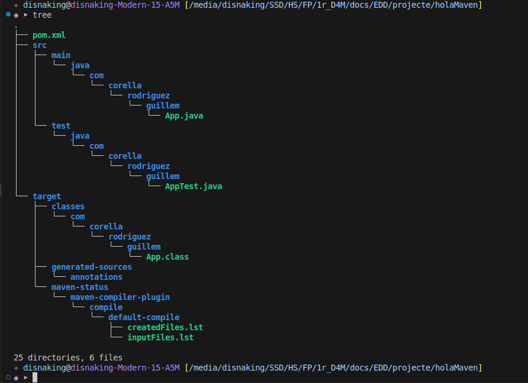
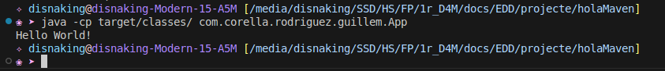

# MAVEN

## Descargar Apache Maven desde la web

## Descomprimir el arxiu i configurar el fitxer .bashrc

## Versión de maven

## Creació del projecte

## mvn compile

## Estructura de fitxers

## Execució

